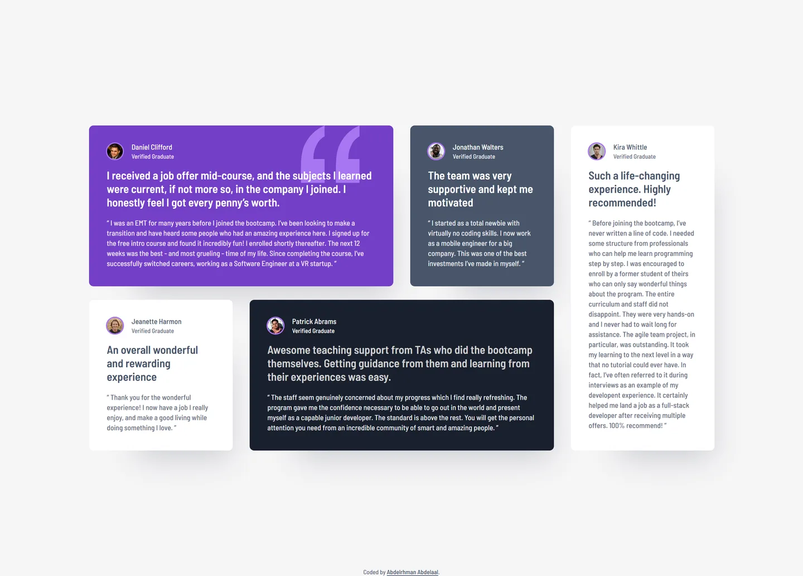

# Frontend Mentor - Testimonials grid section solution

This is a solution to the [Testimonials grid section challenge on Frontend Mentor](https://www.frontendmentor.io/challenges/testimonials-grid-section-Nnw6J7Un7). Frontend Mentor challenges help you improve your coding skills by building realistic projects.

## Table of contents

- [Overview](#overview)
  - [Screenshot](#screenshot)
  - [Links](#links)
- [My process](#my-process)
  - [Built with](#built-with)
  - [Design deviations](#design-deviations)
- [Author](#author)

## Overview

### Screenshot

### Links

- Solution URL: [GitHub](https://github.com/MrBlackvanta/testimonials-grid-section)
- Live Site URL: [Netlify](https://vanta-testimonials-grid-section.netlify.app)

## My process

### Built with

- [Next.js 16](https://nextjs.org/) (App Router, React Compiler, Turbopack)
- [React 19](https://react.dev/)
- [TypeScript](https://www.typescriptlang.org/) (strict)
- [Tailwind CSS v4](https://tailwindcss.com/)

### Design deviations

Every number below is measured from the `.fig` and from the production build, not from
the JPGs. Contrast is measured against the backdrop each string actually sits on — the
decorative quote glyph included — on rounded 8-bit channels.

**Sixteen of the design's nineteen text pairings already pass AA.** Note that the 20px
lead is weight 600, which is _not_ WCAG large text: axe treats bold as weight ≥ 700, so
every pairing on this page is held to 4.5:1.

**The three that fail, and what shipped:**

|                          | design    | ratio | shipped   | ratio    |
| ------------------------ | --------- | ----- | --------- | -------- |
| card 2 role, mobile only | `#A3AAB4` | 3.22  | `#E7EAEE` | **6.25** |
| card 5 role, mobile only | `#A3AAB4` | 2.34  | `#676D7E` | **5.17** |
| card 1 lead over glyph   | `#FFFFFF` | 3.25  | unchanged | 3.25     |

The first two cost nothing: `#A3AAB4` is white at 50% over Grey 500, it appears only on
the mobile frame, and the tablet and desktop frames paint those same two labels from the
palette. On a white card it measures 2.34, which is a slip rather than a style. Taking the
other two frames' values fixes both with no new colour.

**The glyph pairing ships as designed.** The 104×102 quote mark renders behind the card's
text, so the lead's first line crosses it at every breakpoint. Darkening the glyph to
`#9152ED`, or dropping it to 50% opacity, would clear 4.5 — both cost about the same
watermark separation (1.97 → 1.42 and → 1.41), and neither is necessary for the audit:
axe reports text over a background image as _incomplete_, not failed. The pairing also
clears the 3:1 large-text threshold and misses 4.5 only on the weight-700 bold cutoff.

**Two style-guide colours are wrong and one is missing.** Purple 300 is not rounded, it is
a different colour: the guide's `hsl(264, 82%, 80%)` is `#C4A2F6`, the file paints
`#A775F1` — ten lightness points apart. Purple 50, Purple 500 and Dark blue are off by 1–2
per channel; Grey 100/200/400/500 are exact. The page background `#F6F5F6` is in no
style guide, and the guide's Black `hsl(0, 0%, 7%)` appears nowhere in the design, so it
ships no token.

**There is no tracking anywhere.** Every text node in all three frames measures
`letterSpacing: 0`. The file's ten non-zero values live in its `Style Guide` frame and
belong to a different challenge's text presets.

**Card heights run 1–2px under the design, everywhere.** Figma rounds a single-line text
frame up: the 13px/13px name measures 14 and the 11px/11px role measures 12, so the
profile block measures 28, 29 **or** 30px across the design's own five cards for identical
content. The CSS line boxes are 13 + 4 + 11 = 28 on all five. Every position delta on the
page is this rounding accumulating down the grid.

**Desktop content is 1110px on a 30px gutter, not the 1114 the `Content` frame reports.**
The card widths only reconcile with 1110: `(1110 − 90) / 4 = 255`, and a two-column span
is `255 + 30 + 255 = 540`, which is exactly what all five cards are drawn at. The design
then nudged cards 2 and 5 right by 2px and 4px, which is what inflates the frame's
bounding box to 1114.

**The four-column layout starts at 1280, not 1024.** The design has no frame between 768
and 1440, and the desktop grid needs its full 1110px: at 1024 four columns are 199.75px
wide, leaving 136px of text against the design's 191 and stretching Kira's card to 784px.
So the two-column tablet layout holds to 1279, capped at 880px of content so its cards
keep their drawn proportions, and prose inside full-span cards is capped at 584px — the
design's own tablet text width, so the cap is invisible at 768 and at 1440.

**The design's tablet line breaks assume the full 768px.** With a classic 15px scrollbar
the content is 633px rather than 648, which pushes card 1's quote to five lines and card
2's lead to three. At a true 768px content area every line count in the design is
reproduced exactly, at every breakpoint.

**Card 4 inverts the pattern the other four follow** — its lead is Grey 200 where every
other card's is the strong colour, and its role is pure white where every other card's is
dimmed. All three frames agree and both clear 10:1, so it ships as drawn.

**Card 2's quote closes with an opening quote mark** in the design file. The marks are
`::before`/`::after` content, so the data holds the quotation only and the typo cannot
recur. The `developent` misspelling in Kira's quote is Frontend Mentor's own — it is in
both the design file and the starter HTML — and is kept.

**The design has no heading and no footer.** A page needs a top-level heading, so there is
a visually hidden `<h1>`, and the required attribution makes the page taller than the mock.

**Jeanette's and Kira's photographs are replacements**, so those two avatars will not match
the design JPGs. All five are circle-masked transparent WebP at 56px, built by
`scripts/prepare-avatars.mjs` in the parent repo.

## Author

- UpWork - [Abdelrhman Abdelaal](https://upwork.com/freelancers/~01f0a9479696b61f49)
- Frontend Mentor - [@MrBlackvanta](https://www.frontendmentor.io/profile/MrBlackvanta)
- LinkedIn - [Abdelrhman Abdelaal](https://www.linkedin.com/in/abdelrhman-vanta/)
